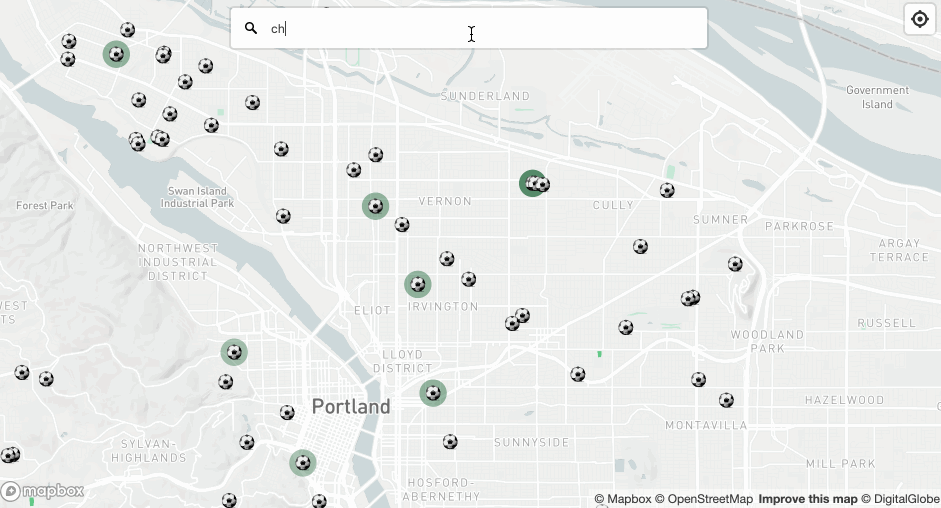
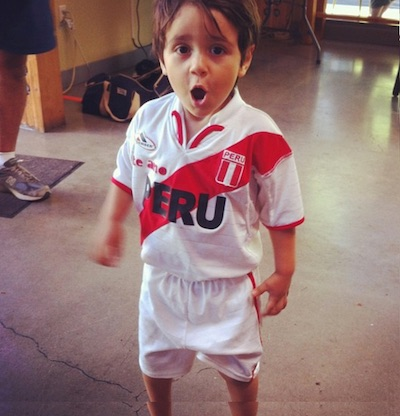

# PDX.FUTBOL
Find a pickup game. Find a field.

Looking for a pickup game or just trying to find your field? You can find a field, directions, and the time it will take to drive there. Search for a field or address.

Click the ⚽️ to get the field's name, pickup times (if available), directions, and drive time. 

Fields with green circles indicate a pickup location according to the <a href="https://www.facebook.com/groups/PortlandPickUpSoccerers/">Portland Pickup Facebook Group</a>. Check the group for up to date activities.

Don't see your field or want to make a suggestion? 
<a href="mailto:soundofrafa@gmail.com?subject=Reporting%20Pitchfinder%20location&body=Please%20report%20a%20missing%20location,%20location%20edit,%20or%20type-o.">Email</a> your suggestion or edit for a specific location.

## Who

I love the beautiful game. I also love <a href="https://www.mapbox.com/">maps</a>.
Find me on <a href="https://twitter.com/geografa">Twitter</a> or at a pickup.
## Dev
This site is open source and written in vanilla JavaScript and HTML. The map is made with <a href="https://www.mapbox.com/">Mapbox</a> and uses the <a href="https://www.mapbox.com/api-documentation/#directions">Directions API</a>. All fields are estimated from <a href="https://www.openstreetmap.org/">OpenStreetMap</a>, a community-driven open source mapping project.
